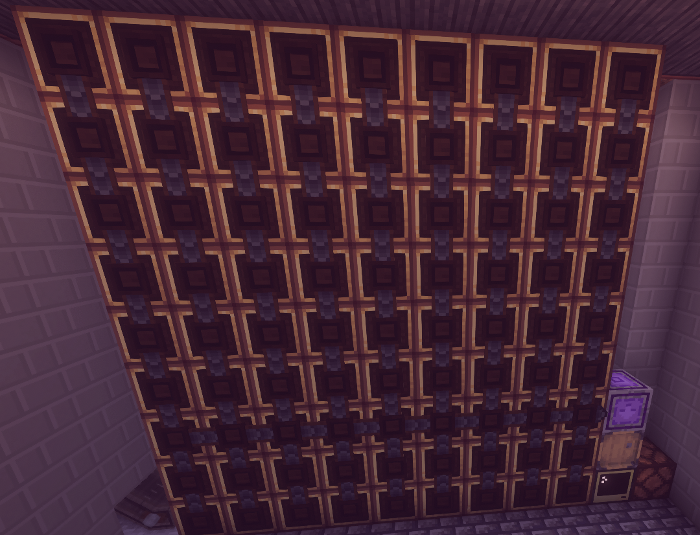

> [!WARNING]
> 🇨🇳 **zh-CN / Chinese (Simplified)**
> 
> 注意：本自述文件由人工智能助手（反重力）自动翻译，可能包含翻译错误或不准确之处。如需最准确和最新的文档，请参阅英文原文 [README.md](../../../README.md).

🌐 **Languages:** [English](../../../README.md) | [Deutsch](../de/README.md) | [Español](../es/README.md) | [Français](../fr/README.md) | [Português (Brasil)](../pt-BR/README.md) | [日本語](../ja/README.md) | [한국어](../ko/README.md) | [Русский](../ru/README.md) | [简体中文](../zh-CN/README.md)

# 创建机械工匠自动化🛠️

> 完全自动化、可用于生产的 ComputerCraft 系统，适用于 **Create** 模组中的 **Mechanical Crafters**。专为在**阻止模式**下与 AE2/精致存储无缝集成而设计。


---

## ✨ 特点

- **游戏内配方记录** — 将物品放入工匠中，按“S”，输入名称。完毕。无需 JSON 编辑。
- **可视化菜谱管理** — 按“M”浏览所有保存的菜谱、查看所需原料并管理模式。
- **交互式网格校准** — 通过顺序调制解调器激活自动检测您的精确网格布局。
- **AE2 / RS 阻塞模式就绪** — 针对缓冲箱集成进行了优化，并保证了单工艺处理。
- **智能堵塞检测** - 实时警报显示导致瓶颈的确切工匠槽位和物品。
- **实时仪表板** — 颜色编码的高性能 UI 显示网格状态、工作历史记录和缺失的成分。

---

## 🛠️ 硬件设置




1. **高级计算机** — 彩色高分辨率仪表板所需。
2. **工匠网格** — 构建您的阵列（例如，3×3、5×5、9×9）。
3. **网络（关键步骤）：**
- 将**有线调制解调器**连接到**每个**机械工匠。
- 使用 **网络电缆** 将所有调制解调器连接到计算机。
- 右键单击调制解调器，直到 **红环** 亮起。
- **重要提示：** 在校准期间，您必须按照**读取顺序**（左上 → 右上，然后逐行）激活调制解调器。
4. **缓冲箱** — 通过有线调制解调器连接与计算机相邻的箱子（例如钻石箱）。
5. **红石触发器** — 将红石信号从计算机的**任意一侧**连接到 Crafters。

---

## 🚀 安装与使用

1.从repo下载install.lua文件
```bash
wget https://raw.githubusercontent.com/Zonk1987/CC-Tweaked-Programs/main/install.lua
```
2.运行install.lua文件
```bash
install.lua
```
3. 选择**创建 Mechanical Crafter 自动化**。
4. **校准**：首次启动时，按照屏幕提示依次右键单击调制解调器。这将物理网格映射到软件。
5. **阻止模式**：将 AE2 模式提供程序设置为面向缓冲区箱的 **“阻止模式”**。

---

## 📖 如何使用

### 记录新食谱
1. 将原料手动放入物理机械工匠中。
2. 按仪表板上的 **`S`**。
3. 输入名称并按 **ENTER**。系统扫描网格并立即保存！

### 管理食谱
1. 按仪表板上的**`M`** 打开管理器。
2.浏览菜谱，查看食材，按**`X`**删除旧图案。

---

## ⌨️ 热键

| 钥匙 | 行动 |
|:---:|---|
| **`S`** | **扫描/记录**来自网格的新菜谱*（用空名称按 ENTER 键取消）* |
| **`M`** | **管理**保存的食谱和查看模式 |
| **`R** | **从“crafter_recipes.json”重新加载**食谱 |
| **`问`** | **退出**（退出配方管理器菜单并返回仪表板） |

---

## ⚙️配置

该系统配有交互式图形配置菜单，可轻松自定义设置：

- **更改配置设置**：您可以随时通过运行以下命令来启动配置界面：
  ```bash
  startup.lua --config
  ```
  或者：
  ```bash
  startup.lua -c
  ```
  这使您能够动态选择缓冲箱并自定义控制台的文本颜色。
- **重新校准**：物理调制解调器的布局映射保存在 `crafter_mapping.json` 中。如果您要重新校准网格（例如改变了机械工匠的物理布局），只需删除 `crafter_mapping.json` 文件并正常启动程序即可。

---

## 🛑 故障排除

| 错误 | 原因与修复 |
|---|---|
| “缓冲箱不见了！” | 胸部的调制解调器已关闭或已断开连接。 |
| “没有机械工匠！” | 未找到调制解调器。检查电缆和红色环！ |
| “卡住了：插槽 #X” | 制作尚未完成。检查红石脉冲和功率。 |
| `模式不匹配` | 网格中的错误项目或映射文件已损坏。重新校准！ |

---
*与 ❤️ 一起开发，用于高级代理编码。*


