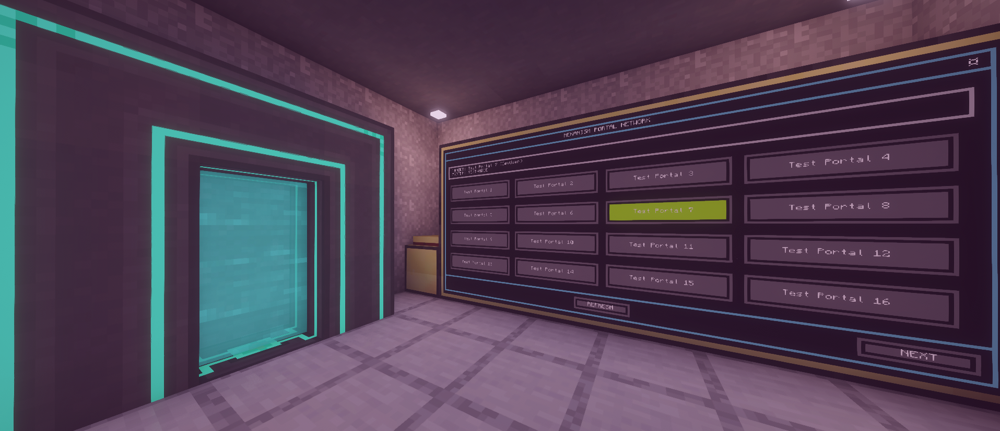

# Mekanism Portal Network (CC:Tweaked)

> A professional, high-performance touch interface for **Mekanism Teleporters**. Features a flicker-free double-buffered UI, multi-page frequency management, and a built-in frequency editor with color customization.

---

## ✨ Features

- **Double-Buffered Rendering** — Zero-flicker UI updates using a custom window-based buffer system.
- **Moveable Overlay Windows** — Drag the color selection menu anywhere on the screen for optimal visibility.
- **Accent Stripe Indicators** — High-contrast vertical bars on buttons show assigned colors with black shadow-borders for visibility on any background.
- **Dynamic Portal Grid** — Automatically discovers all frequencies with smart pagination and automatic **Page-Reset** on list changes.
- **Real-Time Status Monitoring** — Live feedback on portal status, target frequency, and owner (with Mojang UUID resolution).
- **Edit Mode & Color Customization** — Assign specific colors to frequencies or use the random color cycle.
- **Remote Recall Support** — Integrated Modem and Rednet API for remote portal activation (via Recaller script).

---

## 🛠️ Hardware Setup



1. **Advanced Computer** — Required for high-resolution graphics and double-buffering.
2. **Advanced Monitor**
   - Recommended size: **4x3 blocks** for the best button layout.
   - Connect via **Wired Modems** and Networking Cables.
3. **Mekanism Teleporter**
   - Connect the Teleporter to the same cable network using a **Wired Modem**.
   - Right-click the modem to turn it **ON** (red ring).
4. **Modem (Optional)**
   - Attach a Wireless or Wired Modem to the computer to enable **Remote Recall** functionality.

---

## 🚀 Installation

Run this command on your ComputerCraft terminal:
```bash
wget https://raw.githubusercontent.com/Zonk1987/CC-Tweaked-Programs/main/install.lua
install.lua
```
Select **Mekanism Portal Dialer Hub** from the menu. The installer will automatically resolve all core dependencies (`HubSystem`, `Dashboard`, `ButtonGrid`).

---

## ⚙️ Configuration

Open `startup` on the computer to customize the system behavior:

- `gridColumns` / `gridRows`: Adjust the number of buttons per page.
- `textScale`: Change the UI size for different monitor dimensions.
- `recallChannel`: Set the modem channel for remote portal requests (default: 99).

---

## ⌨️ Controls & Modes

### **Dialer Mode (Default)**
- **Tap a Portal** — Instantly switch the teleporter frequency. The button will remain highlighted until the hardware confirms the change.
- **Next/Prev** — Switch between pages if you have many frequencies.

### **Edit Mode (Settings Icon)**
1. Tap the **¤** icon in the top right corner to enter Edit Mode.
2. Select any portal to open the **Color Overlay**.
3. Pick a **Fixed Color** for that specific portal or select **RANDOM** for dynamic color cycling.
4. Use the **MOVE** bar at the top of the overlay to shift the window if it blocks your view.

---

## 📡 Remote Recall API

The system listens for modem messages on the configured `recallChannel`. To trigger a portal remotely, send a table with the following structure:
```lua
{
    command = "RECALL",
    target = "My Base" -- Name of the frequency
}
```
Alternatively, you can use the dedicated **Mekanism Portal Recaller** script on a handheld pocket computer.

---

## 📝 Credits
Developed as part of the **Advanced Agentic Coding** initiative for professional Minecraft automation.
