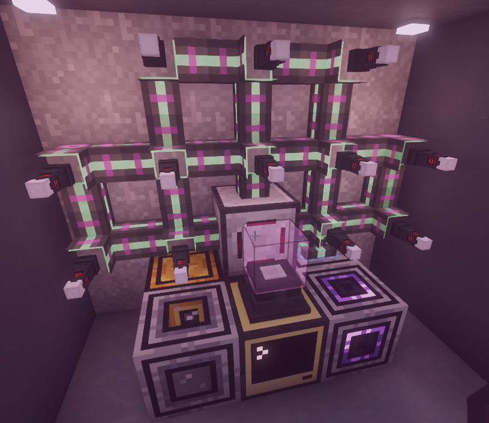

# Powah Energizing Orb Automation (CC:Tweaked)

> Fully automated, production-ready ComputerCraft system for the **Energizing Orbs** from the **Powah** mod. Supports parallel processing, advanced AE2 integration, and intelligent modpack compatibility.

---

## ✨ Features

- **Multi-Orb Support** — Automatically discovers all connected Energizing Orbs and crafts in parallel.
- **AE2 ME Bridge Integration** — Direct connection to your AE2 network to read and import patterns.
- **Intelligent Recipe Importer** — Press `I` to browse and import AE2 patterns directly into the system. No more manual typing of item IDs!
- **Modpack Compatibility** — Filter by "Powah Only" or "All Mods" (Key `F`) to support custom modpack recipes that use the Energizing Orb.
- **High-Precision Matching** — Deep ID-based ingredient validation with support for **Bulk Processing** (Multiplier logic).
- **Auto-Recovery** — Automated item retrieval and orb reset if crafting stalls or power fails.
- **Pretty-JSON Formatting** — `rezepte.json` is automatically formatted with indentations for easy manual editing.
- **Live Dashboard** — Real-time monitoring of job status, power, and throughput across all orbs.
- **Hot-Reload** — Press `R` to sync changes from `rezepte.json` instantly.

---

## 🛠️ Hardware Setup



1. **Advanced Computer** — Required for the colored high-resolution dashboard.
2. **Buffer Chest** — Place a chest adjacent to the computer (default: `"left"`). This acts as the intake for AE2 Patterns.
3. **Energizing Orbs** — Connect all Orbs via **Networking Cables** and **Wired Modems**.
4. **ME Bridge (Optional)** — Connect an **ME Bridge** (from Advanced Peripherals) to the network to enable AE2 Import features.
5. **Logistics** — Use an Import Bus (AE2) on the Orbs to extract finished products. Set the Pattern Provider to **Blocking Mode** facing the Buffer Chest.

---

## 🚀 Installation

Run this command on your ComputerCraft terminal:
```bash
pastebin run vYK0cPkU
```
Select **Powah Energizing Orb Automation** to download the latest modular version.

---

## 📖 AE2 Recipe Import

The easiest way to add recipes is via the **ME Bridge**:
1. Create a **Processing Pattern** in AE2 (e.g., 1x Nether Star + 2x Redstone Block = 16x Nitro Crystal).
2. Put the pattern into any ME Pattern Provider in your network.
3. Open the Dashboard on the Computer and press **`I`**.
4. Find your recipe in the list.
   - 🟢 **Green Bullet**: Already imported and matches exactly.
   - 🔴 **Red Bullet**: Not yet in `rezepte.json`.
5. Press **`ENTER`** to import. The system handles all multipliers and technical IDs automatically!
6. (Optional) Press **`F`** to toggle between Powah recipes and all other mods.

---

## ⌨️ Hotkeys

| Key | Action |
|:---:|---|
| **`R`** | **Reload** `rezepte.json` without restarting |
| **`I`** | **Import Menu** (Browse and add AE2 Patterns) |
| **`F`** | **Filter Toggle** (Inside Import Menu: Powah vs. All Mods) |
| **`Q`** | **Exit** menus or the main script |

---

## ⚙️ Configuration

Open `startup` to customize your setup:
```lua
local system = PowahSystem:new("left", "rezepte.json")
```
- Change `"left"` to the side where your **Buffer Chest** is located.
- The system automatically finds the **ME Bridge** and all **Energizing Orbs** on the network.

---

## 🛑 Troubleshooting

| Error | Cause & Fix |
|---|---|
| `No ME Bridge found!` | Check if the ME Bridge is connected via cable and the modem is active. |
| `Transfer Error!` | The Orb is full or the item was pulled before the transfer finished. |
| `Timeout in Orb...` | No power or crafting process took longer than 60s. Items are returned to the chest. |
| `Red Bullets in Import` | This is normal! It means the AE2 pattern isn't in your `rezepte.json` yet. Just press ENTER to fix it. |

---
*Developed with ❤️ for Advanced Agentic Coding.*